Diamonds DataSet Analysis
================

# GitHub Documents

``` r
library(ggplot2)
```

### 1\) Load the “diamonds” dataset contained in ggplot

``` r
diamonds<-ggplot2::diamonds
```

### 2\) Trace the number of diamonds according to their cut(diag in bars)

``` r
ggplot(diamonds)+(mapping = aes(x=cut))+geom_bar() +ggtitle("Number of Diamonds based on Cut")
```

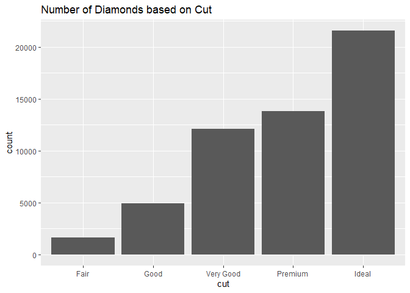<!-- -->

### 3\) Make a histogram with carat in x and an interval of 0.5:

### How many diamonds are there between 0.25 and 0.75 carats?

``` r
count<-ggplot(diamonds)+(mapping = aes(x=carat))+geom_histogram(binwidth = 0.5)+stat_bin(geom="text",aes(label=..count.., x=carat),binwidth = 0.5)+ggtitle("Histogram to count Diamonds based on Carats")
count
```

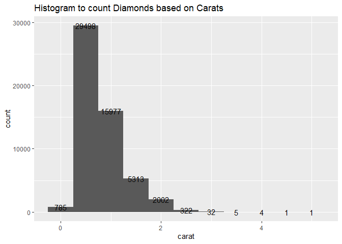<!-- -->

### To verify the number of diamonds

``` r
ggplot_build(count) 
```

    ## $data
    ## $data[[1]]
    ##        y count   x  xmin xmax      density       ncount     ndensity
    ## 1    785   785 0.0 -0.25 0.25 2.910641e-02 0.0266119737 0.0266119737
    ## 2  29498 29498 0.5  0.25 0.75 1.093734e+00 1.0000000000 1.0000000000
    ## 3  15977 15977 1.0  0.75 1.25 5.923990e-01 0.5416299410 0.5416299410
    ## 4   5313  5313 1.5  1.25 1.75 1.969967e-01 0.1801139060 0.1801139060
    ## 5   2002  2002 2.0  1.75 2.25 7.423063e-02 0.0678690081 0.0678690081
    ## 6    322   322 2.5  2.25 2.75 1.193919e-02 0.0109159943 0.0109159943
    ## 7     32    32 3.0  2.75 3.25 1.186504e-03 0.0010848193 0.0010848193
    ## 8      5     5 3.5  3.25 3.75 1.853912e-04 0.0001695030 0.0001695030
    ## 9      4     4 4.0  3.75 4.25 1.483129e-04 0.0001356024 0.0001356024
    ## 10     1     1 4.5  4.25 4.75 3.707824e-05 0.0000339006 0.0000339006
    ## 11     1     1 5.0  4.75 5.25 3.707824e-05 0.0000339006 0.0000339006
    ##    flipped_aes PANEL group ymin  ymax colour   fill size linetype alpha
    ## 1        FALSE     1    -1    0   785     NA grey35  0.5        1    NA
    ## 2        FALSE     1    -1    0 29498     NA grey35  0.5        1    NA
    ## 3        FALSE     1    -1    0 15977     NA grey35  0.5        1    NA
    ## 4        FALSE     1    -1    0  5313     NA grey35  0.5        1    NA
    ## 5        FALSE     1    -1    0  2002     NA grey35  0.5        1    NA
    ## 6        FALSE     1    -1    0   322     NA grey35  0.5        1    NA
    ## 7        FALSE     1    -1    0    32     NA grey35  0.5        1    NA
    ## 8        FALSE     1    -1    0     5     NA grey35  0.5        1    NA
    ## 9        FALSE     1    -1    0     4     NA grey35  0.5        1    NA
    ## 10       FALSE     1    -1    0     1     NA grey35  0.5        1    NA
    ## 11       FALSE     1    -1    0     1     NA grey35  0.5        1    NA
    ## 
    ## $data[[2]]
    ##        y label count   x  xmin xmax width      density       ncount
    ## 1    785   785   785 0.0 -0.25 0.25   0.5 2.910641e-02 0.0266119737
    ## 2  29498 29498 29498 0.5  0.25 0.75   0.5 1.093734e+00 1.0000000000
    ## 3  15977 15977 15977 1.0  0.75 1.25   0.5 5.923990e-01 0.5416299410
    ## 4   5313  5313  5313 1.5  1.25 1.75   0.5 1.969967e-01 0.1801139060
    ## 5   2002  2002  2002 2.0  1.75 2.25   0.5 7.423063e-02 0.0678690081
    ## 6    322   322   322 2.5  2.25 2.75   0.5 1.193919e-02 0.0109159943
    ## 7     32    32    32 3.0  2.75 3.25   0.5 1.186504e-03 0.0010848193
    ## 8      5     5     5 3.5  3.25 3.75   0.5 1.853912e-04 0.0001695030
    ## 9      4     4     4 4.0  3.75 4.25   0.5 1.483129e-04 0.0001356024
    ## 10     1     1     1 4.5  4.25 4.75   0.5 3.707824e-05 0.0000339006
    ## 11     1     1     1 5.0  4.75 5.25   0.5 3.707824e-05 0.0000339006
    ##        ndensity flipped_aes PANEL group  ymax ymin colour size angle hjust
    ## 1  0.0266119737       FALSE     1    -1   785    0  black 3.88     0   0.5
    ## 2  1.0000000000       FALSE     1    -1 29498    0  black 3.88     0   0.5
    ## 3  0.5416299410       FALSE     1    -1 15977    0  black 3.88     0   0.5
    ## 4  0.1801139060       FALSE     1    -1  5313    0  black 3.88     0   0.5
    ## 5  0.0678690081       FALSE     1    -1  2002    0  black 3.88     0   0.5
    ## 6  0.0109159943       FALSE     1    -1   322    0  black 3.88     0   0.5
    ## 7  0.0010848193       FALSE     1    -1    32    0  black 3.88     0   0.5
    ## 8  0.0001695030       FALSE     1    -1     5    0  black 3.88     0   0.5
    ## 9  0.0001356024       FALSE     1    -1     4    0  black 3.88     0   0.5
    ## 10 0.0000339006       FALSE     1    -1     1    0  black 3.88     0   0.5
    ## 11 0.0000339006       FALSE     1    -1     1    0  black 3.88     0   0.5
    ##    vjust alpha family fontface lineheight
    ## 1    0.5    NA               1        1.2
    ## 2    0.5    NA               1        1.2
    ## 3    0.5    NA               1        1.2
    ## 4    0.5    NA               1        1.2
    ## 5    0.5    NA               1        1.2
    ## 6    0.5    NA               1        1.2
    ## 7    0.5    NA               1        1.2
    ## 8    0.5    NA               1        1.2
    ## 9    0.5    NA               1        1.2
    ## 10   0.5    NA               1        1.2
    ## 11   0.5    NA               1        1.2
    ## 
    ## 
    ## $layout
    ## <ggproto object: Class Layout, gg>
    ##     coord: <ggproto object: Class CoordCartesian, Coord, gg>
    ##         aspect: function
    ##         backtransform_range: function
    ##         clip: on
    ##         default: TRUE
    ##         distance: function
    ##         expand: TRUE
    ##         is_free: function
    ##         is_linear: function
    ##         labels: function
    ##         limits: list
    ##         modify_scales: function
    ##         range: function
    ##         render_axis_h: function
    ##         render_axis_v: function
    ##         render_bg: function
    ##         render_fg: function
    ##         setup_data: function
    ##         setup_layout: function
    ##         setup_panel_guides: function
    ##         setup_panel_params: function
    ##         setup_params: function
    ##         train_panel_guides: function
    ##         transform: function
    ##         super:  <ggproto object: Class CoordCartesian, Coord, gg>
    ##     coord_params: list
    ##     facet: <ggproto object: Class FacetNull, Facet, gg>
    ##         compute_layout: function
    ##         draw_back: function
    ##         draw_front: function
    ##         draw_labels: function
    ##         draw_panels: function
    ##         finish_data: function
    ##         init_scales: function
    ##         map_data: function
    ##         params: list
    ##         setup_data: function
    ##         setup_params: function
    ##         shrink: TRUE
    ##         train_scales: function
    ##         vars: function
    ##         super:  <ggproto object: Class FacetNull, Facet, gg>
    ##     facet_params: list
    ##     finish_data: function
    ##     get_scales: function
    ##     layout: data.frame
    ##     map_position: function
    ##     panel_params: list
    ##     panel_scales_x: list
    ##     panel_scales_y: list
    ##     render: function
    ##     render_labels: function
    ##     reset_scales: function
    ##     setup: function
    ##     setup_panel_guides: function
    ##     setup_panel_params: function
    ##     train_position: function
    ##     xlabel: function
    ##     ylabel: function
    ##     super:  <ggproto object: Class Layout, gg>
    ## 
    ## $plot

<!-- -->

    ## 
    ## attr(,"class")
    ## [1] "ggplot_built"

### There are 29498 diamonds 0.25 and 0.75 carats

### 4\) Make a frequency polygon diagram (geom\_freqpoly)

``` r
ggplot(diamonds)+(mapping = aes(x=carat, color=cut))+geom_freqpoly()+ggtitle("Frequency polygon with each color corresponding to a different cut")
```

    ## `stat_bin()` using `bins = 30`. Pick better value with `binwidth`.

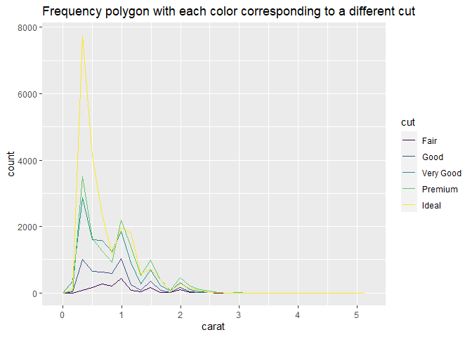<!-- -->

### 5\) Same with bars filled with diamonds clarity

``` r
ggplot(diamonds)+(mapping = aes(x=carat, color=clarity))+geom_bar() +ggtitle("Bars filled with diamonds clarity ")
```

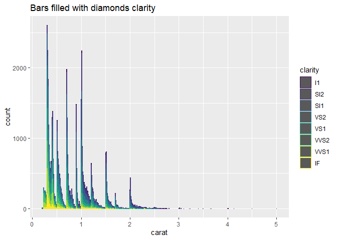<!-- -->

### 6\) Draw several graphs to try to see which variable has the most influence on price

``` r
ggplot(diamonds)+(mapping = aes(x= carat, y=price))+geom_point(color="blue")+ggtitle("Price vs Carat")
```

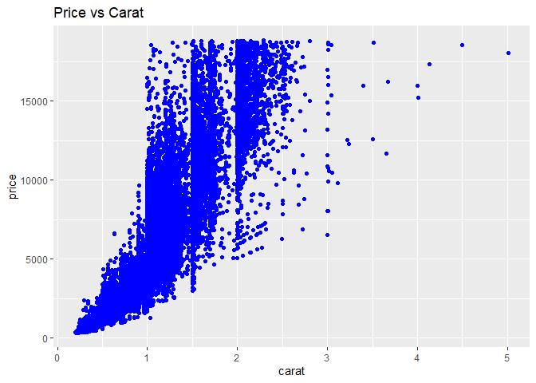<!-- -->

``` r
ggplot(diamonds)+(mapping = aes(x= cut, y=price))+geom_point(color="blue")+ggtitle("Price vs Cut")
```

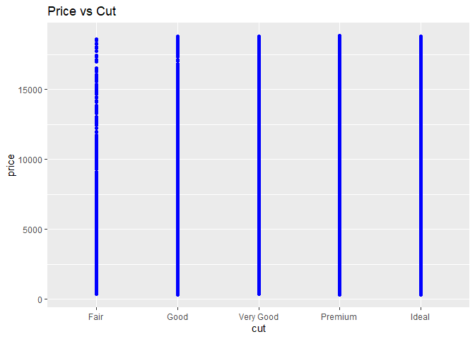<!-- -->

``` r
ggplot(diamonds)+(mapping = aes(x= clarity, y=price))+geom_point(color="blue")+ggtitle("Price vs Clarity")
```

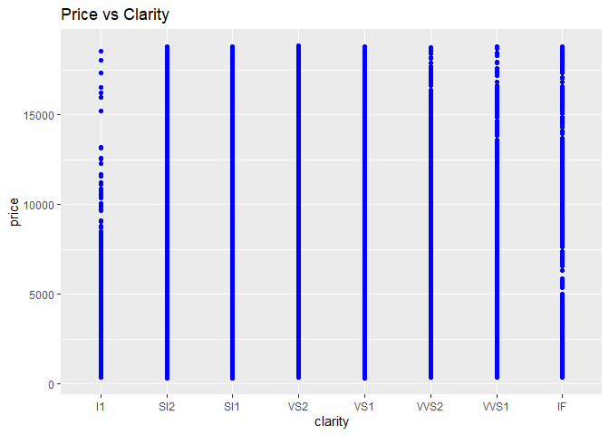<!-- -->

``` r
ggplot(diamonds)+(mapping = aes(x= color, y=price))+geom_point(color="blue")+ggtitle("Price vs color")
```

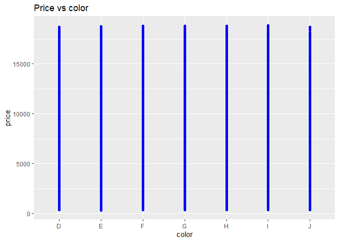<!-- -->

``` r
ggplot(diamonds)+(mapping = aes(x= depth, y=price))+geom_point(color="blue")+ggtitle("Price vs depth")
```

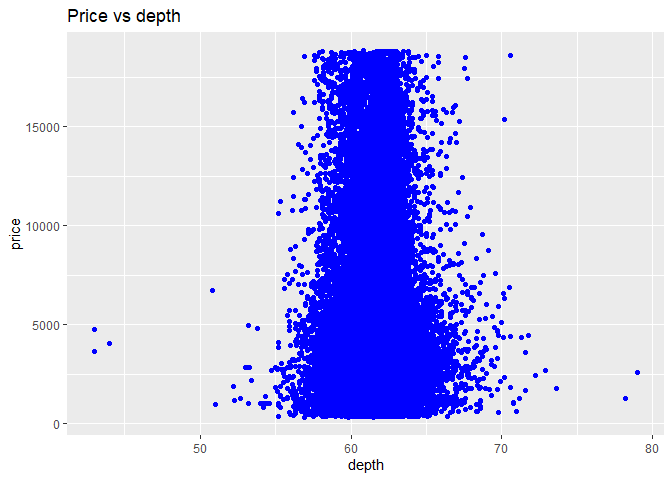<!-- -->

``` r
ggplot(diamonds)+(mapping = aes(x= table, y=price))+geom_point(color="blue")+ggtitle("Price vs table")
```

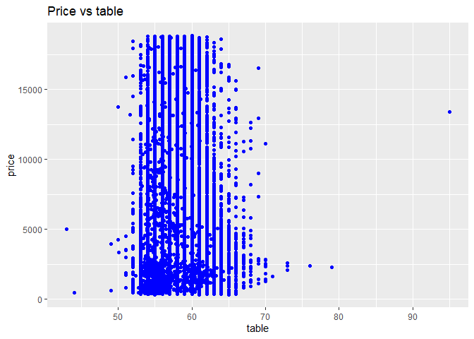<!-- -->

``` r
ggplot(diamonds)+(mapping = aes(x= x, y=price))+geom_point(color="blue")+ggtitle("Price vs x")
```

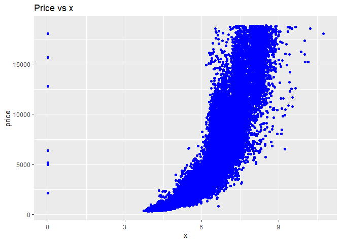<!-- -->

``` r
ggplot(diamonds)+(mapping = aes(x= y, y=price))+geom_point(color="blue")+ggtitle("Price vs y")
```

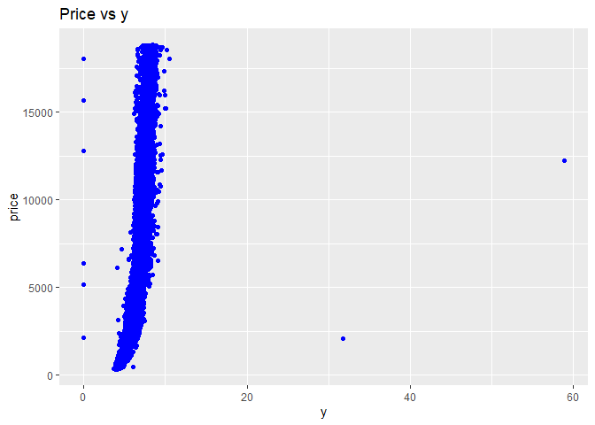<!-- -->

``` r
ggplot(diamonds)+(mapping = aes(x= z, y=price))+geom_point(color="blue")+ggtitle("Price vs z")
```

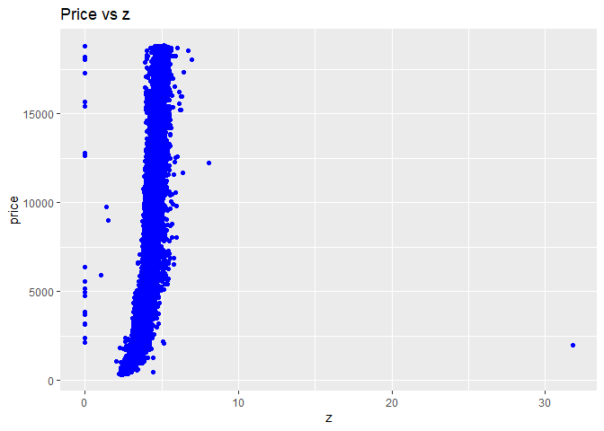<!-- -->

## Based on the graphs above, I would conclude that the price of the diamonds directly depend on the Carat.
