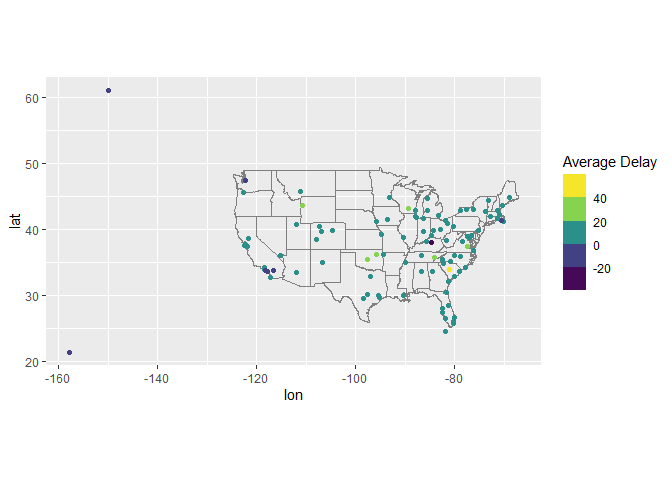
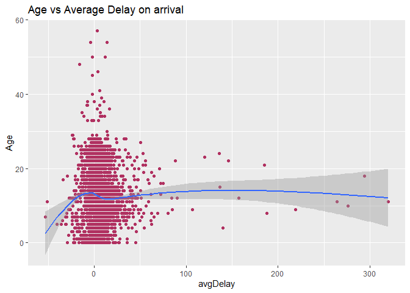
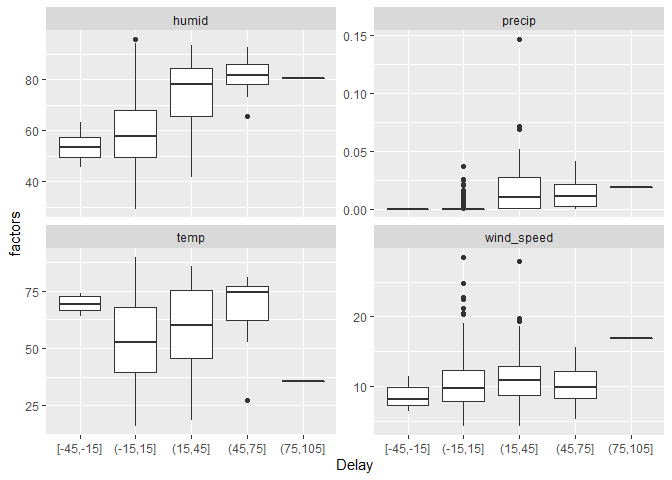
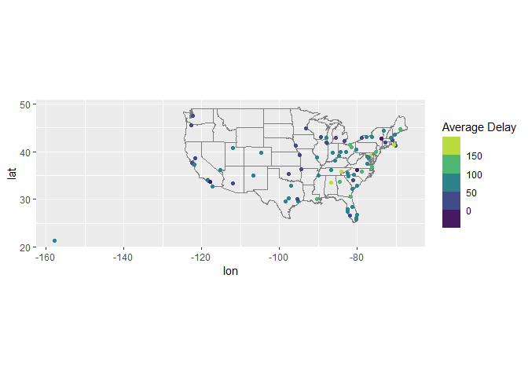

Analysis on nycflights DataSet
================

# GitHub Documents

### Loading Packages

``` r
library(nycflights13)
library(ggplot2)
library(tidyr)
library(dplyr)
```

    ## 
    ## Attaching package: 'dplyr'

    ## The following objects are masked from 'package:stats':
    ## 
    ##     filter, lag

    ## The following objects are masked from 'package:base':
    ## 
    ##     intersect, setdiff, setequal, union

### Loading datasets

``` r
flights<-nycflights13::flights
airports<-nycflights13::airports
weather<-nycflights13::weather
planes<-nycflights13::planes
```

### Joining datasets (Flights)

### 1\) Calculate the average delay by destination and then join with the airports table to plot the time distribution on a map.

``` r
by_day<-group_by(flights,dest)
avgDelay<-summarise(by_day, delay=mean(arr_delay,na.rm = TRUE))

airports %>% inner_join ( avgDelay , c ( "faa" = "dest" )) %>% ggplot(aes(lon, lat, colour=delay))+borders("state")+geom_point()+ coord_quickmap () + scale_colour_viridis_b("Average Delay")
```

    ## Warning: Removed 1 rows containing missing values (geom_point).

<!-- -->

### 2\) Add lattitudes and longitudes of departure and arrival airports on the flight board

``` r
flightsAirports<-flights%>%left_join(select(airports,faa,lat,lon),by=c("origin"="faa"))%>%rename(origin_lat=lat,origin_lon=lon)
flightsAirports<-flightsAirports%>%left_join(select(airports,faa,lat,lon),by=c("dest"="faa"))%>%rename(dest_lat=lat,dest_lon=lon)
```

### 3\) Is there a relationship between the age of an aircraft and its average delay (on arrival)?

``` r
by_plane<-group_by(flights,tailnum)
avgPlaneDelay<-summarise(by_plane,avgDelay=mean(arr_delay,na.rm = TRUE))
avgPlaneDelay<-avgPlaneDelay%>%left_join(select(planes,tailnum,year),by="tailnum")
avgPlaneDelay<-mutate(avgPlaneDelay, Age=2013-year)
avgPlaneDelay %>% ggplot(aes(x=avgDelay,y=Age))+geom_point(color = "maroon")+geom_smooth()+ggtitle("Age vs Average Delay on arrival")
```

    ## `geom_smooth()` using method = 'gam' and formula 'y ~ s(x, bs = "cs")'

    ## Warning: Removed 798 rows containing non-finite values (stat_smooth).

    ## Warning: Removed 798 rows containing missing values (geom_point).

<!-- -->

### 4\) What influence does weather have on flight delays (look at the precipitation variable)?

``` r
by_day_Month<-group_by(flights,month,day)%>%summarise(Delay=mean(arr_delay, na.rm = TRUE))
avgWeather<-weather %>% group_by(month, day) %>%select(-hour) %>% summarize_at(vars(temp, humid, wind_speed, precip), mean, na.rm = TRUE)
by_day_Month<-by_day_Month%>%left_join(avgWeather, by=c("month","day"))
by_day_Month%>%ungroup() %>%mutate(Delay = cut_width(Delay, 30)) %>%gather(weather, factors, -(month:Delay)) %>%ggplot(aes(x=Delay,y=factors))+geom_boxplot()+ facet_wrap(~ weather,scales = "free_y")
```

    ## Warning: Removed 4 rows containing non-finite values (stat_boxplot).

<!-- -->

### 5)What happened on June 13, 2013?

``` r
flight_filtered<-flights %>%  group_by(month, day, dest) %>%  summarize(avg_delay = mean(arr_delay, na.rm = TRUE)) %>%  filter(month == 6, day == 13)
flight_filtered%>%left_join(select(airports, faa, lat, lon), by = c("dest" = "faa")) %>%  ggplot(aes(lon, lat, colour = avg_delay)) +  borders("state") +  geom_point() +  coord_quickmap() + scale_colour_viridis_b("Average Delay")
```

    ## Warning: Removed 7 rows containing missing values (geom_point).

<!-- -->
